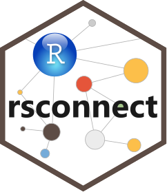

<!-- README.md is generated from README.Rmd. Please edit that file -->

# rsconnect <a href='https://rstudio.github.io/rsconnect/'></a>

<!-- badges: start -->

[](https://cran.r-project.org/package=rsconnect)
[](https://lifecycle.r-lib.org/articles/stages.html#stable)
[](https://github.com/rstudio/rsconnect/actions)

<!-- badges: end -->

rsconnect makes it easy to publish your Shiny apps, RMarkdown and Quarto
documents, and Plumber APIs to [Posit
Connect](https://posit.co/products/enterprise/connect/),
[ShinyApps.io](https://www.shinyapps.io/), and [Posit
Cloud](https://posit.cloud/) from R.

(If you’re looking for the Python equivalent, try
[rsconnect-python](https://pypi.org/project/rsconnect-python/).)

## Installation

You can install the released version of rsconnect from
[CRAN](https://CRAN.R-project.org) with:

``` r
install.packages("rsconnect")
```

And the development version from [GitHub](https://github.com/) with:

``` r
# install.packages("devtools")
devtools::install_github("rstudio/rsconnect")
```

## Setup

To use rsconnect, you first need to teach it about the server you want
to publish to. If you use the RStudio IDE, the easiest way to get set up
is to use the publishing dialog, which you can find by clicking the
“Tools” menu, then selecting “Global options”, then clicking
“Publishing”. Click “Connect” to add new servers.

You can also connect from any R session by running a little code:

- For shinyapps.io, go to your [tokens
  page](https://www.shinyapps.io/admin/#/tokens) and click “Add Token”,
  then follow the instructions to copy and paste the appropriate call to
  `setAccountInfo()`. Learn more in the [Getting Started
  Guide](https://shiny.rstudio.com/articles/shinyapps.html).

- For Posit Connect, first use `addServer()` to register your server
  with rsconnect, then call either `connectUser()` or
  `connectApiUser()`. `connectUser()` is a bit simpler if you’re in an
  interactive session; `connectApiUser()` works anywhere but requires a
  you to copy and paste an API key from your user profile.

- For Posit Cloud, login, then click your name in the top-right corner,
  click “Account”, then click “Tokens” in the navbar at the top of the
  page. Click “New Token”, then “Copy” next to the token you just
  created, and then follow the instructions to copy and paste the
  appropriate call to `setAccountInfo()`.

Now that you’re setup you can use `deployApp()`, `deployDoc()`, and
friends to publish your apps, documentations, APIs and more.
