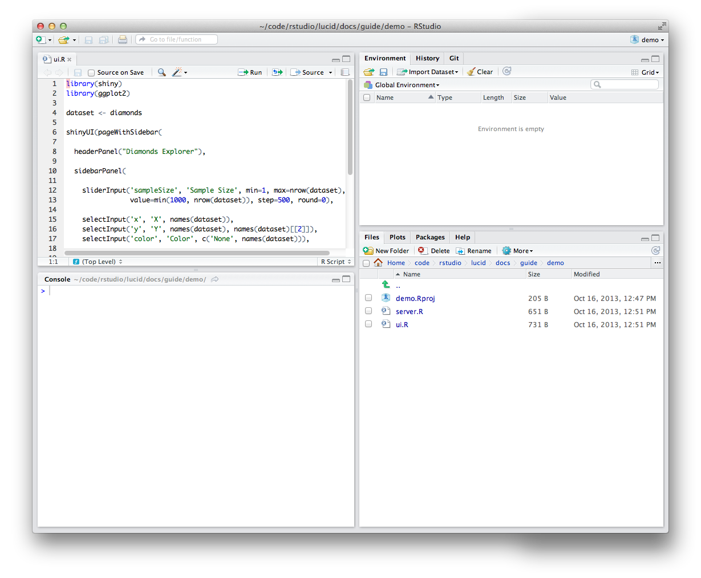
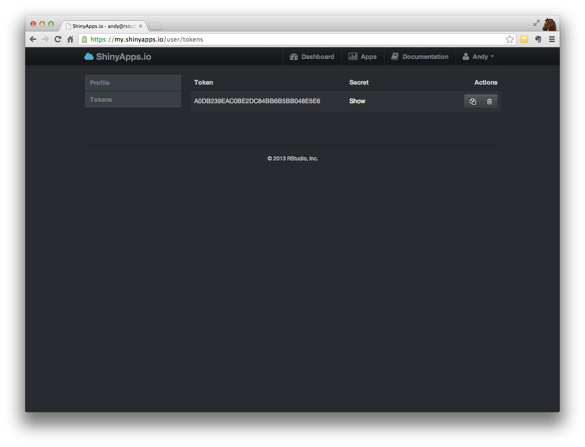

# Getting Started Guide
ShinyApps is a platform as a service (PaaS) for hosting Shiny applications.  This guide should help you get started 
with ShinyApps.io allowing you to create your online account, and deploy your first Shiny application to the cloud.


## Requirements

To get started with ShinyApps you will need:

- An R development environment
- The latest version of the `devtools` package 
- The `shinyapps` package from GitHub
- A working shiny application on your machine

### Create A Project

You will probably want to create a new RStudio project for your application. For this guide, we will create a
a project called "demo". For this example, we have placed two Shiny source files: ui.R and server.R that you 
can cut and paste into your project.

<!--- Does it have to be a separate project? will this work from an arbitrary directory? -->

**server.R**
```S
library(shiny)
library(ggplot2)

shinyServer(function(input, output) {

  dataset <- reactive(function() {
    diamonds[sample(nrow(diamonds), input$sampleSize),]
  })

  output$plot <- reactivePlot(function() {

    p <- ggplot(dataset(), aes_string(x=input$x, y=input$y)) + geom_point()

    if (input$color != 'None')
      p <- p + aes_string(color=input$color)

    facets <- paste(input$facet_row, '~', input$facet_col)
    if (facets != '. ~ .')
      p <- p + facet_grid(facets)

    if (input$jitter)
      p <- p + geom_jitter()
    if (input$smooth)
      p <- p + geom_smooth()

    print(p)

  }, height=700)

})
```

**ui.R**
```S
library(shiny)
library(ggplot2)

dataset <- diamonds

shinyUI(pageWithSidebar(

  headerPanel("Diamonds Explorer"),

  sidebarPanel(

    sliderInput('sampleSize', 'Sample Size', min=1, max=nrow(dataset),
                value=min(1000, nrow(dataset)), step=500, round=0),

    selectInput('x', 'X', names(dataset)),
    selectInput('y', 'Y', names(dataset), names(dataset)[[2]]),
    selectInput('color', 'Color', c('None', names(dataset))),

    checkboxInput('jitter', 'Jitter'),
    checkboxInput('smooth', 'Smooth'),

    selectInput('facet_row', 'Facet Row', c(None='.', names(dataset))),
    selectInput('facet_col', 'Facet Column', c(None='.', names(dataset)))
  ),

  mainPanel(
    plotOutput('plot')
  )
))
```




### Test your application

This demo Shiny application requires the 'ggplot2' package. You should ensure that any package that is required 
by your application is installed locally before you deploy your application.  In this example you can run the 
following command should your runApp() fail:

    install.packages(c('ggplot2', 'shiny'))

You can test that your application works by running shiny.

    library(shiny)
    runApp()

### Installing the `devtools` package

ShinyApps makes uses of the latest improvements to the `devtools` package, you will need to update `devtools` to
the latest version from GitHub using `devtools`.

If you do not already have `devtools` installed, you can install it from CRAN using:

    install.packages('devtools')

To update devtools to the latest version from GitHub run: 

    devtools::install_github(username='hadley', repo='devtools')

    (restart your R session)


<!--- (So meta...) I've always used the abbreviated syntax of `install_githunb("devtools", "hadley")` ... if you value brevity over explicitness. -->

### Installing the `shinyapps` package

The `shinyapps` package is used to deploy Shiny applications to ShinyApps.io. The package can only be installed 
from GitHub at this time. Currently the repository is private, so you will need to provide your GitHub username
and password.

Install the `shinyapps` package using `devtools`:

    devtools::install_github('rstudio/shinyapps')

After the `shinyapps` package has been installed, load it into your R session:

    library(shinyapps)

## Configuring ShinyApps

To use the `shinyapps` package, you will need to signup for a ShinyApps.io account. When you create your account, a
token and secret will be generated automatically for you. This token and secret are used in place of your username
and password when deploying and managing applications.

### Sign In to ShinyApps.io

Go to [my.shinyapps.io](http://my.shinyapps.io) and click "Sign In". You will be prompted to signin using your Google Account.
The first time you signin, you will be prompted to create an account. The account name will be used
as the domain name for all your applications. Account names must be between 4 and 63 characters and
can only contain letters, numbers and dashes (-). Additionally, account names may not begin with a
number or a dash or end with a dash (see [RFC 952](http://tools.ietf.org/html/rfc952)). Some account names may
be reserved.

### Configuring your account

Once your account is set up in ShinyApps.io, you will want to configure the `shinyapps` package to
use your account. You will need to retrieve your token from the ShinyApps.io dashboard. Tokens are
listed under the `Profile > Tokens` page.



You can configure the `shinyapps` package to use your account two ways:

#### Method 1

Click the copy button on the token page and paste the result into your R session. This will
automatically paste the full syntax of `setAccountInfo` with the appropriate parameters for your
account.

#### Method 2

Run the 'setAccountInfo' function from the `shinyapps` package passing in the token and secret from the
Profile / Tokens page.

    shinyapps::setAccountInfo(name="<ACCOUNT>", token="<TOKEN>", secret="<SECRET>")

## Packages

### Package Dependencies

When you deploy your application, the `shinyapps` package will attempt to detect the packages that
are used by your application. This list of packages and its dependencies are sent along with your
code to the ShinyApps.io service so the packages can be built and installed into the R library for
your application. The first time you deploy your application, it may take some time to build these
packages depending on how many of them there are. However, you will not have to wait for these
packages to build during subsequent deployments (unless you upgrade or downgraded a package).

For more information on application package dependencies, see the documentation for the `shinyapps`
package.

<!--- Any more specific links? (Or is it not written yet?) This seems important. -->

### Package Sources

Currently, the ShinyApps.io service only supports deploying packages that are from CRAN, and GitHub.

BioConductor and R-Forge packages will be supported soon.

### Important Note on GitHub Packages

Only packages that are installed from GitHub with the `devtools::install_github` using the
**latest** version of `devtools` are supported. This means that packages that you have previously
installed from GitHub using `devtools`, may need to be reinstalled before you can deploy your
application.

__If you are getting an error such as "PackageSourceError" when you attempt to deploy, this is
likely the reason. Remember, any GitHub package, and its dependencies will need to be reinstalled
using the latest version of `devtools`.__

## Deploying Applications

To deploy your application, use the `deployApp` command from the `shinyapps` packages.

    deployApp()


Once the deploy finishes, your browser should automatically open up to your newly deployed application.

Congratulations! you've deployed your first application. :-)

Feel free to make changes to your code, and run `deployApp` again, you will note the second time you
deploy, it takes much as time, as the packages have already been built.

### Application Instances

When an application is deployed, it runs on a it's own virtualized server called an instance. Each
instance runs an identical copy of the code and packages that were deployed (called the image).

During an application deployment, a new image is created with the updated code and packages, and
one or more instances are started with the new image. The old instances are shutdown and destroyed.
This has a few implications that should be taken into consideration when writing and deploying
Shiny applications on the ShinyApps.io platform:

1) __Data written by a Shiny application to the local filesystem of an instance, will not be persisted
across application deployments.__ Additionally, the distributed nature of the ShinyApps.io platform
means that instances may be shutdown and re-created at any time for maintenance or to recover from
server failures.

2) It possible to have more then one instance of an application. This means that __multiple instances
of an application do not share a local filesystem__. A file written to one instance will not be written
to the other.

In addition to providing an isolated environment for each application, instances are also limited in
the amount of system resources they are allowed to consume. This means that instances are only
allowed to use a given amount of memory depending on their type. The table below outlines the various
instance types, and how much memory is allowed. __By default, all applications are deployed on
'small' instances, and are allowed to use 256 MB of memory.__

<table>
  <tr>
    <th>
    Instance Type
    </th>
    <th>
    Memory
    </th>
  </tr>
  <tr>
    <td>
    small (default)
    </td>
    <td>
    256 MB
    </td>
  </tr>
  <tr>
    <td>
    medium
    </td>
    <td>
    512 MB
    </td>
  </tr>
  <tr>
    <td>
    large
    </td>
    <td>
    1024 MB
    </td>
  </tr>
  <tr>
    <td>
    xlarge
    </td>
    <td>
    2048 MB
    </td>
  </tr>
  <tr>
    <td>
    xxlarge
    </td>
    <td>
    4096 MB
    </td>
  </tr>
</table>

Note: Instance types and limits are not finalized, and may be changed in the future.

The instance type used by an application can be changed using the `configureApp` function from the
`shinyapps` package. See the section below on /Configuring Shiny Applications/.

### Configuring Shiny Applications

Both the instance type, and the number of instances of an application are configurable using the 
`configureApp` function from the `shinyapps` package.

To change the instance type of your application from the default of small to medium run:

    shinyapps::configureApp(size="medium")

This will redeploy your application using the medium instance type.
